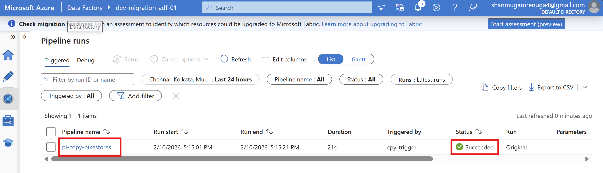

# Azure Data Engineering Portfolio
### Hands-on cloud data integration and migration labs

**Azure Data Factory · Azure SQL · Self-Hosted Integration Runtime**

A learning portfolio of Azure data engineering projects. The current project demonstrates a hybrid migration from an on-premises SQL Server database to Azure SQL Database using Azure Data Factory (ADF) and a Self-Hosted Integration Runtime (SHIR).

## Project catalog

| Project | Focus |
|---|---|
| [01 · On-prem SQL Server to Azure SQL](01-onprem-sql-to-azure/README.md) | Hybrid data movement with ADF and SHIR; linked services, pipeline execution, and ARM templates |

### Pipeline run

## What the project demonstrates

- Configure on-premises and Azure linked services
- Connect ADF to an on-premises source through a locally hosted SHIR
- Build and run a pipeline that copies SQL data into Azure SQL
- Inspect copied rows in source and destination tables
- Export the factory configuration as ARM templates for redeployment
- Consider resource cleanup and cloud costs in a learning environment

## Repository structure

- `01-onprem-sql-to-azure/README.md` — project steps, architecture, and learning outcomes
- `01-onprem-sql-to-azure/factory/` — Data Factory assets
- `01-onprem-sql-to-azure/linkedTemplates/` — linked ARM template artifacts
- `01-onprem-sql-to-azure/screenshots/` — setup and execution evidence
- `ARMTemplateForFactory.json` — exported factory template

## Rebuild and cost awareness

The project README describes deployment through Azure Portal using the exported ARM template. Cloud resources may incur charges; review the resources and pricing in your own subscription, and remove disposable resources when finished. The repository contains educational artifacts and does not provision resources automatically.

---

Small, reproducible labs for practical cloud data engineering.

